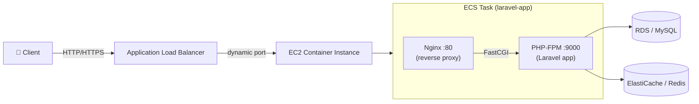

<div align="center">

# 🚀 Laravel on AWS ECS (EC2) — Production Deployment Blueprint

**A batteries-included, copy-and-ship blueprint for deploying a containerized Laravel application to Amazon ECS (EC2 launch type) behind an Application Load Balancer — with a ready-to-run local development stack and a CI/CD pipeline.**

[](https://laravel.com)
[](https://www.php.net)
[](https://www.docker.com)
[](https://nginx.org)
[](https://aws.amazon.com/ecs/)
[](LICENSE)
[](CONTRIBUTING.md)

</div>

---

## Overview

Getting a PHP application onto AWS ECS involves a lot of moving parts — a multi-container task (PHP-FPM + a web server), an image registry, a load balancer with dynamic port mapping, and a deployment pipeline. This repository packages that entire path as a **reusable reference architecture** you can clone, point at your own AWS account, and deploy.

It ships two production-oriented Docker images (a hardened **PHP-FPM** app container and an **Nginx** reverse proxy), a **Docker Compose** stack that spins up the app, Nginx, MySQL, and Redis locally with one command, an exportable **ECS task definition**, and a **GitLab CI/CD** pipeline that builds, pushes to ECR, and rolls out a new task revision.

> **Who is this for?** DevOps and backend engineers who want a known-good, documented pattern for running Laravel on ECS/EC2 instead of assembling it from scratch.

## ✨ Features

- 🐳 **Two-container architecture** — PHP-FPM app + Nginx proxy, communicating over FastCGI, matching AWS's recommended sidecar pattern.
- ⚡ **One-command local environment** — `docker compose up` gives you app + Nginx + MySQL 8 + Redis, wired together and ready.
- ☁️ **ECS on EC2, ALB-ready** — task definition uses dynamic host-port mapping so multiple tasks can share an EC2 instance behind an Application Load Balancer.
- 🔁 **CI/CD included** — GitLab pipeline builds both images, pushes to Amazon ECR (immutable + `latest` tags), and triggers a zero-downtime ECS service update.
- 🔒 **Security-conscious defaults** — non-root container user, least-privilege file permissions, `.env` never committed, and CloudWatch logging pre-wired.
- 🩺 **Health-check endpoint** — a lightweight `/health` route for ALB target-group checks.
- 📚 **Fully documented** — architecture, deployment, and local-dev guides live in [`docs/`](docs/).

## 🏗️ Architecture



**Request flow:** the ALB forwards traffic to the Nginx container on a dynamically assigned host port; Nginx serves static files and proxies PHP requests over FastCGI to the PHP-FPM container; the app talks to MySQL and Redis. See [`docs/ARCHITECTURE.md`](docs/ARCHITECTURE.md) for the full breakdown.

## 🧰 Tech Stack

| Layer | Technology |
| :--- | :--- |
| **Application** | Laravel 8 (PHP 8.1) |
| **Web server** | Nginx (Alpine) |
| **App runtime** | PHP-FPM (Alpine) with `pdo_mysql`, `gd`, `redis`, `zip`, `exif`, `pcntl` |
| **Local orchestration** | Docker Compose (app, nginx, MySQL 8, Redis) |
| **Container registry** | Amazon ECR |
| **Orchestration** | Amazon ECS (EC2 launch type) |
| **Ingress** | Application Load Balancer (dynamic port mapping) |
| **CI/CD** | GitLab CI |
| **Data & cache** | MySQL / Amazon RDS, Redis / ElastiCache |

## 📂 Repository Structure

```
.
├── Dockerfile               # PHP-FPM application image (installs Composer deps)
├── Dockerfile_Nginx         # Nginx reverse-proxy image
├── docker-compose.yml       # Local dev stack: app + nginx + mysql + redis
├── .dockerignore            # Keeps build context (and images) lean
├── taskdef.json             # Exportable ECS task definition (2 containers)
├── .gitlab-ci.yml           # Build → push to ECR → deploy to ECS
├── Makefile                 # Shortcuts: make up / build / deploy-vars ...
├── .env.example             # Environment template (copy to .env)
├── config/
│   ├── nginx/conf.d/app.conf  # Nginx server block + /health endpoint
│   └── php/local.ini          # PHP runtime tuning (upload size, memory)
├── docs/                    # Architecture, deployment & local-dev guides
└── app/ routes/ ...         # Standard Laravel application code
```

## ✅ Prerequisites

- [Docker](https://docs.docker.com/get-docker/) & Docker Compose v2
- An AWS account with permissions for **ECR, ECS, EC2, and ELB** (for deployment)
- [AWS CLI v2](https://docs.aws.amazon.com/cli/latest/userguide/getting-started-install.html) (for deployment)

## ⚡ Quick Start (Local Development)

```bash
# 1. Clone
git clone <your-fork-url> && cd laravel-ecs-ec2

# 2. Create your environment file
cp .env.example .env

# 3. Build and start the full stack (app + nginx + mysql + redis)
docker compose up -d --build

# 4. Generate the app key and run migrations
docker compose exec app php artisan key:generate
docker compose exec app php artisan migrate
```

Now open **http://localhost:8080** 🎉

> Prefer shortcuts? Run `make up` — see the [`Makefile`](Makefile) for the full list.

Full walkthrough: [`docs/LOCAL_DEVELOPMENT.md`](docs/LOCAL_DEVELOPMENT.md).

## ☁️ Deploying to AWS ECS

Deployment is fully documented step-by-step in **[`docs/DEPLOYMENT.md`](docs/DEPLOYMENT.md)**. The high-level flow:

1. **Create two ECR repositories** — `laravel-app` and `laravel-nginx`.
2. **Create an ECS cluster** (EC2 launch type) and register the task definition from [`taskdef.json`](taskdef.json).
3. **Provision an Application Load Balancer** + target group (dynamic port mapping).
4. **Create an ECS service** attached to the ALB.
5. **Configure CI/CD variables** (below) and push to trigger a build & deploy.

### Required CI/CD variables

Set these in **GitLab → Settings → CI/CD → Variables**:

| Variable | Description |
| :--- | :--- |
| `AWS_ACCESS_KEY_ID` | IAM key with ECR/ECS permissions |
| `AWS_SECRET_ACCESS_KEY` | IAM secret |
| `AWS_DEFAULT_REGION` | e.g. `us-east-1` |
| `ECR_REGISTRY` | `<AWS_ACCOUNT_ID>.dkr.ecr.<AWS_REGION>.amazonaws.com` |
| `ECR_REPOSITORY_APP_IMAGE` | `${ECR_REGISTRY}/laravel-app` |
| `ECR_REPOSITORY_NGINX_IMAGE` | `${ECR_REGISTRY}/laravel-nginx` |
| `ECS_CLUSTER` | ECS cluster name (e.g. `laravel`) |
| `ECS_SERVICE` | ECS service name (e.g. `laravel-deployment`) |

> ⚠️ **Never commit real credentials or account IDs.** All AWS identifiers in this repo are placeholders (`<AWS_ACCOUNT_ID>`, `<AWS_REGION>`); supply real values only through CI/CD variables or your local `.env` (which is git-ignored).

## ⚙️ Configuration

Environment is driven by `.env` (copy from [`.env.example`](.env.example)). Key values:

| Variable | Purpose | Local default |
| :--- | :--- | :--- |
| `APP_KEY` | Laravel encryption key (`php artisan key:generate`) | — |
| `DB_HOST` / `DB_DATABASE` / `DB_USERNAME` / `DB_PASSWORD` | Database connection | `db` / `laravel` / `laravel` / `secret` |
| `REDIS_HOST` | Redis host | `redis` |
| `SESSION_DRIVER` / `CACHE_DRIVER` | Backed by Redis in the container stack | `redis` |
| `APP_PORT` | Host port Nginx binds to locally | `8080` |

## 🩺 Health Check

The Nginx config exposes a `/health` endpoint that returns `200 OK` without hitting PHP — use it as the ALB target-group health check path:

```bash
curl http://localhost:8080/health   # -> healthy
```

## 🤝 Contributing

Contributions are welcome! Please read [`CONTRIBUTING.md`](CONTRIBUTING.md) before opening a pull request.

## 📄 License

Distributed under the MIT License. See [`LICENSE`](LICENSE) for details.

## 🙌 Acknowledgements

Inspired by community patterns for running Laravel on AWS ECS, adapted into a documented, reusable blueprint.

---

<div align="center">
<sub>If this blueprint saved you time, consider giving it a ⭐ — it helps others find it.</sub>
</div>
