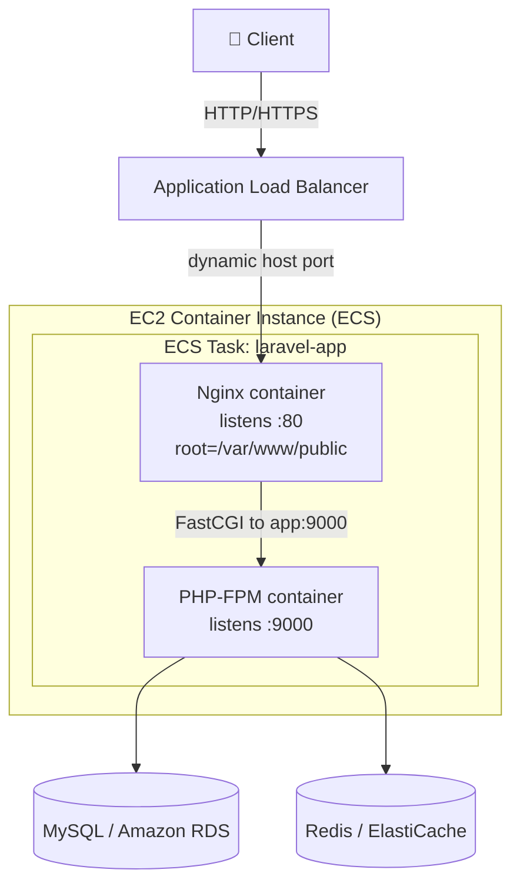

# Architecture

This blueprint runs a Laravel application as **two cooperating containers** —
an Nginx reverse proxy and a PHP-FPM application runtime — orchestrated by
Amazon ECS on EC2 container instances and exposed through an Application Load
Balancer (ALB).

## Why two containers?

PHP-FPM does not speak HTTP; it speaks FastCGI. A web server (Nginx) is needed
to terminate HTTP, serve static assets, and forward dynamic requests to
PHP-FPM. Splitting them into separate containers keeps each image small,
single-purpose, and independently scalable — the pattern AWS recommends for
PHP workloads on ECS.

## Component diagram

## Request lifecycle

1. A client request hits the **ALB** on port 80/443.
2. The ALB routes to the **Nginx** container via a **dynamically assigned host
   port** on the EC2 instance (allowing multiple tasks per instance).
3. **Nginx** serves static files directly from `/var/www/public`. For `*.php`
   requests it proxies over FastCGI to the **PHP-FPM** container at `app:9000`.
4. **Laravel** executes the request, reading/writing **MySQL** and **Redis**.
5. The response flows back through Nginx and the ALB to the client.

## Container startup ordering

Nginx depends on the app container. In the ECS task definition this is
expressed with:

- A **container dependency** (`app` must reach `START` before `nginx` starts).
- A **link** from the `nginx` container to `app`, so Nginx can resolve the
  `app` hostname used in `fastcgi_pass app:9000`.

Locally, Docker Compose expresses the same relationship with `depends_on`.

## Dynamic port mapping & the ALB

The `nginx` container maps container port `80` to host port `0` (dynamic). ECS
assigns an ephemeral host port per task and registers it with the ALB target
group. This is what lets several copies of the task run on a single EC2
instance without port collisions — the foundation for horizontal scaling.

## Health checks

Nginx exposes `GET /health`, which returns `200 healthy` without invoking PHP.
Point the ALB target group's health-check path at `/health` so instance health
reflects the proxy layer being up.

## Data & cache tier

The application containers are **stateless**. Persistent state lives in managed
services:

- **MySQL** — Amazon RDS in production (a `mysql:8.0` container locally).
- **Redis** — Amazon ElastiCache in production (a `redis:alpine` container
  locally), backing sessions and cache.

Keeping the app tier stateless is what makes tasks freely replaceable and
scalable.

## Related documents

- [Deployment guide](DEPLOYMENT.md)
- [Local development guide](LOCAL_DEVELOPMENT.md)
